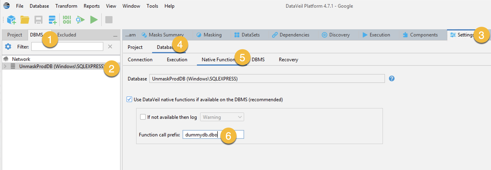

# Masking with DataVeil

This repository can be used to integrate [DataVeil](https://www.dataveil.com) masking software with [Actifio](https://docs.actifio.com/Actifio-GO) and [Google Cloud Backup and DR](https://cloud.google.com/backup-disaster-recovery/docs) 

This readme first contains a section for [SQL Server](#sql-server-masking-with-dataveil) and then a section for [Oracle](#oracle-masking-with-actifio-and-dataveil)

## SQL Server Masking with DataVeil

This readme describes how to use the bat file in this repository along with the DataVeil software to perform data masking on an SQL Server database.

### Requirements

An SQL Server Database that requires data masking.  This is our Production Database.

In Production we would use three Windows Servers, each with Microsoft SQL installed.  In general always use the same version of MS SQL on each server, as you may not be able to mount from a higher version to a lower version (although the reverse is normally possible, meaning production could a be a lower version than the masking server).


* Production Server (Production Side – hosts the source DB)
* Masking Server (Production Side – masks the source DB)
* Development Server or Servers (Non-Production Side – uses the masked DB)

For PoC we could use just one server for the entire process (we don’t need three).
But in production it would not be normal to run production, masking and non-production activities all on the production server.

For each stage of the process use a different database name.  For instance:

* Production Name:   **ProdDB**
* Name when mounted to masking server:   **UnmaskProdDB**
* Name when mounted to development server:  **MaskedProdDB**

### SQL Server must accept TCP Connections

On the masking server, you need to ensure that:

1. The ```SQL Server Browser``` service is set to **Automatic** startup and is is in the **Running** status.  Do this by opening ```Services.msc```
1. in ```SQL Server Configuration Manager``` that TCP connections to the database are Enabled even if only to 127.0.0.1

### DataVeil setup

The steps we follow for initial setup will be:

1. Mount production database to masking server using the *middle* name (so mount ```ProdDB``` as ```UnmaskProdDB```)
1. Place DataVeil onto your masking server (you also need JRE 1.8) by copying the ```dataVeil``` folder out of the unpacked zip file.
1. Create a ```DV_Files``` folder and copy the license file into it
1. Start DataVeil and point it to where you put the license file (this is a one time task)
1. In Dataveil go to **Database > Add Database Connection** leaving the ```Database Type``` set to SQL Server
1. Add your Masking Host Hostname and Instance name and use ```Test Connection``` to check connect to your databases
1. Use ```Get Schema``` to load the DB schema
1. Run discovery and define your masking rules
1. Save the Project and note:
    * Where you saved the project file
    * The project name 
    * The project key value
1. Add the bat file to the masking server and customize it as described in the nest steps

The bat file must be located in:

* Actifio: ```C:\Program Files\Actifio\Scripts\dvmask.bat```
* Backup and DR: ```C:\Program Files\Google Cloud Backup and DR\Scripts\dvmask.bat```

There are five customizations needed in the bat file:

1. Change ```dataveil64.exe``` path to match yours 
1. Change Project path and name to match yours
1. Change key defined in project to match yours
1. Change license path and name to match yours
1. Change log file path

If you change the .bat file name you need to change the workflow to point to the new name of the script
You must use the correct Scripts folder, no other folder can be used
DO NOT put any other files called by the Batch file into ```C:\Program Files```

### Test your bat file

Presuming we have created the project file and placed the bat file in the correct spot.
Presuming the relevant database is still mounted and ready. 
Run the bat file with the word *test* as shown in the example:

~~~
cd "C:\Program Files\Actifio\Scripts”
dvmask.bat test
~~~
or
~~~
cd "C:\Program Files\Google Cloud Backup and DR\Scripts\"
dvmask.bat test
~~~

Now check the DataVeil log file defined in your bat file to ensure good masking has occurred.  You should actually see the result in your CMD prompt window anyway, but it is good to evaluate the logs were created.

This is an example of successful masking execution:

```
Wed Nov 23 00:53:07 GMT 2022 INFO DataVeil started in batch mode.
Wed Nov 23 00:53:07 GMT 2022 INFO Using param --project=D:\DV_Files\prodbmasking.dvp
Wed Nov 23 00:53:07 GMT 2022 INFO Using param --key=<specified>
Wed Nov 23 00:53:07 GMT 2022 INFO Using param --refreshschema=true
Wed Nov 23 00:53:07 GMT 2022 INFO Using param --compilewarning=continue
Wed Nov 23 00:53:07 GMT 2022 INFO Using param --createdirs=true
Wed Nov 23 00:53:07 GMT 2022 INFO Using param --log=D:\DV_Files\dvlog.txt!
Wed Nov 23 00:53:07 GMT 2022 INFO Using param --component_home=D:\dataveil\DataVeilUserData\Components
Wed Nov 23 00:53:07 GMT 2022 INFO Using param --dataset_home=D:\dataveil\DataVeilUserData\Datasets
Wed Nov 23 00:53:07 GMT 2022 INFO Using param --reportdir=D:\dataveil\DataVeilUserData\Masking\Results\Masking Current
Wed Nov 23 00:53:07 GMT 2022 INFO Using param --reportkeep=20
Wed Nov 23 00:53:07 GMT 2022 INFO Using param --license=D:\DV_Files\license.dvl
Wed Nov 23 00:53:09 GMT 2022 INFO Loading project file D:\DV_Files\prodbmasking.dvp
Wed Nov 23 00:53:13 GMT 2022 INFO Refresh Schema of "UnmaskProdDB (Windows\SQLEXPRESS)" has completed.
Wed Nov 23 00:53:14 GMT 2022 INFO DataVeil native function library on dbo not found, not accessible or version not compatible when attempting to mask data on [UnmaskProdDB]
Wed Nov 23 00:53:14 GMT 2022 INFO Checking schema on "UnmaskProdDB (Windows\SQLEXPRESS)" for changes that could affect masking definitions...
Wed Nov 23 00:53:14 GMT 2022 INFO Compile completed successfully.
Wed Nov 23 00:53:14 GMT 2022 INFO DataVeil version 4.7.1
Wed Nov 23 00:53:14 GMT 2022 INFO Java: Vendor=Oracle Corporation, Version=18.0.2, Home=D:\DataVeil\jdk\win_x64\jdk-18.0.2
Wed Nov 23 00:53:14 GMT 2022 INFO OS: Name=Windows Server 2019, Version=10.0, Architecture=amd64
Wed Nov 23 00:53:14 GMT 2022 INFO Database UnmaskProdDB (Windows\SQLEXPRESS) is on Microsoft SQL Server 2019 (RTM) - 15.0.2000.5 (X64), Sep 24 2019 13:48:23, Copyright (C) 2019 Microsoft Corporation, Express Edition (64-bit) on Windows Server 2019 Datacenter 10.0 <X64> (Build 17763: ) (Hypervisor)
Wed Nov 23 00:53:14 GMT 2022 INFO Project prodbmasking: Database UnmaskProdDB has defined 1 sensitive columns containing a combined total of 19,972 values. This includes 19,972 values using Premium masks.
Wed Nov 23 00:53:15 GMT 2022 INFO Preparing Person Given Name data..
Wed Nov 23 00:53:19 GMT 2022 INFO Started column masking for [UnmaskProdDB].[Person].[Person].[FirstName] (0 null); containing 19,972 rows...
Wed Nov 23 00:53:22 GMT 2022 INFO ...completed PersonFirstName SQL mask for column [UnmaskProdDB].[Person].[Person].[FirstName]; 19,972 of 19,972 rows processed in 3 seconds
Wed Nov 23 00:53:22 GMT 2022 INFO .completed column masking for [UnmaskProdDB].[Person].[Person].[FirstName] (0 null); 19,972 of 19,972 rows processed in 3 seconds
Wed Nov 23 00:53:23 GMT 2022 INFO Started writing table [UnmaskProdDB].[Person].[Person] using Update table IO mode, 19,972 rows...
Wed Nov 23 00:53:23 GMT 2022 INFO .completed writing masked values to table [UnmaskProdDB].[Person].[Person] (as update of original table, 19,972 rows in 0 seconds)
Wed Nov 23 00:53:24 GMT 2022 INFO Project summary: Sensitive values with configured masks = 19,972. Sensitive values masked = 19,972.
Wed Nov 23 00:53:24 GMT 2022 INFO Masking Run of project "prodbmasking" completed on November 23, 2022 at 12:53:24 AM GMT, elapsed time = 10 seconds. No errors or warnings.
Wed Nov 23 00:53:25 GMT 2022 INFO DataVeil terminating with exit code = 0
```
### Create a LiveClone workflow

Now that we have setup our masking server, we are ready to automate masking and presentation of masked data to our non-production hosts.

Use the procedure [here](https://cloud.google.com/backup-disaster-recovery/docs/access-data/create-liveclone-workflows) to create the workflow

In the **Scripts Options** section put the name of your bat file in both the pre and post sections.  


### Supporting Videos For Microsoft SQL

Please watch the following videos either with this playlist:

https://www.youtube.com/playlist?list=PLW0yhWx5VVo30acZo54iF2WhSyXUEwYmE

Or one at a time:

* https://youtu.be/f0lj6bRFxGQ
* https://youtu.be/sh1_vk-1QY8
* https://youtu.be/VqxYX1L-mWA

### Upgrading Dataveil

Because the location of the Dataveil binaries is hard coded in our BAT file, we don't want to change its location during an upgrade so do as follows:

1. Download the new version zip file 
1. Unzip the new version zip file.  You should get a new dataveil folder.
1. Rename the old (Previous version) dataveil folder using the old version number (for backup if needed)
1. Copy the new dataveil folder into place where the old one was
1. Upgrade the [native functions](#sql-server-native-functions) if required 


### SQL Server Native Functions

DataVeil has the option  to use a Native Library to accelerate masking.  To use this you need to run an installation process against the database being masked.   However given it is not wise to connect masking software to a production system and that inserting this function into the database being masked would require additional post-script activity, the solution is to do the following:

1. On the masking server create a dummy database called **dummydb**  This database does not need any data in it.
1. In your dataveil folder there is a file located in a location similar to:   ```d:\dataveil\native\sqlserver\install_01_assembly_from_dll.sql```
Edit this file and change the database name to **dummydb** and the location of the relevant dll called ```DataVeilNativeCLR.dll```
You will need to make a total of three edits (enter the database name twice and change the path to the dll)
1. Having edited the ```install_01_assembly_from_dll.sql``` file, you need to load and run it using Microsoft SQL Server Manager
1. Presuming the first SQL file runs without error, then load and run the second SQL file called ```install_02_udf.sql``` (which requires no edits)
1. Presuming this also runs without error then we have loaded the native functions into a local DB which can be used for masking other DBs.
1. The final step is to edit your project to reference this DB during masking. 
    * Go to the DBMS menu at top left and select your database under Network
    * Go to Settings > Database > Native Functions
    * The Function call prefix box should contain **dbo** which you should change to **dummydb.dbo**



Now when running masking, in the log file you should see a line like this:
```
Wed Nov 23 06:50:16 GMT 2022 INFO DataVeil native function library version 1.2.0 found at dummydb.dbo for masking DBMS [UnmaskProdDB]
```
#### Upgrading MS SQL Native Functions

A new version of dataveil may bring a new version of native function, in which case the old native functions will no longer work. In this example Native Functions 1.0.0 is installed, but DataVeil is now expecting 1.0.1:
```
Tue Sep 03 09:00:13 AEST 2019 INFO DataVeil native function library is not available on dummydb.dbo. Expecting DataVeil Native Library version 1.0.1 or later. Found incompatible version 1.0.0
```
To upgrade the simplest procedure is to:
1.  Delete **dummydb**
1.  Reinstall Native Functions as per the instructions above.

### TroubleShooting 

This section will contain some suggestions for troubleshooting

#### Unmount or reprovision fails with permissions errors

During unmount or unmount portion of reprovision job, you may get an error like this:

```
5242: Actifio Connector: Failed to unmount applications for mounted image. SQL detach script failed with error Msg 5011, Level 14, State 9, Server SYDWINDV1, Line 1 User does not have permission to alter database 'pmbigdb', the database does not exist, or the database is not in a state that allows access checks. Msg 5069, Level 16, State 1, Server SYDWINDV1, Line 1 ALTER DATABASE statement failed. Msg 916, Level 14, State 1, Server SYDWINDV1, Line 1 The server principal "NT AUTHORITY\SYSTEM" is not able to access the database "pmbigdb" under the current security context.
```
Solution:  When mounting with the workflow, make sure the workflow has a valid user/password in the Advanced Setting that has the right to manage SQL DBs.


# Oracle Masking with DataVeil

This readme describes how to use the shell script in this repository along with the DataVeil software to perform data masking.

### Requirements

One Oracle Source Database we can mask.  This is our Production Database.
We need three Oracle Servers, each with Oracle installed.  Match the versions between all servers.

* Production Server (Production Side – hosts the source DB)
* Masking Server (Production Side – masks the source DB)
* Development Server (Non-Production Side – uses the masked DB)

For PoC we could use just one server (we don’t need three).
But in production you would it be very unwise to run production, masking and non-production on the production server.

For each stage of the process use a different database name.  For instance:

* Production Name:   ```prod```
* Name when mounted to masking server:   ```cprod```
* Name when mounted to development server:   ```mprod```

The steps we follow to install or upgrade would be:

1. Unzip DataVeil onto your masking server.   Set permission and test for correct JAVA.  Install JAVA if needed and setup an X11 server to access DataVeil.
1. License DataVeil and note where you put the license file.  Do not put it into the same folder as DataVeil as this will complicate upgrades.
1. Mount production database to masking server using the ‘middle’ name (i.e. mount ```prod``` as ```cprod```)
1. Connect to the database and create Project using DataVeil and note the Project key name
1. Save Project and note where you save the project
1. Install shell script onto masking server and customize it

DataVeil needs to be unzipped onto your masking server.  Unzip it and then create folders to hold your working files and logs.
After unzipping the DataVeil zip file (which in this example we placed into the /opt folder), we need to run the three commands in the chmod_nix file:

```
# pwd
/opt/dataveil
# cat chmod_nix
chmod +x DataVeilLaunchNix
chmod +x bin/dataveil
chmod +x batch/dataveil_cmd_nix
# chmod +x DataVeilLaunchNix
# chmod +x bin/dataveil
# chmod +x batch/dataveil_cmd_nix
```

Here is a typical set of install commands 
```
cd /tmp.  
wget <supplied URL>
unzip actifio_dataveil_4_1_0.zip 
mv dataveil /opt/.
cd /opt/dataveil
chmod +x DataVeilLaunchNix
chmod +x bin/dataveil
chmod +x batch/dataveil_cmd_nix
```

Upgrade commands are almost the same with one extra step (you shouldn't need to do anything for Native Functions):
```
cd /tmp.  
wget <supplied URL>
unzip actifio_dataveil_4_1_0.zip 
mv /opt/dataveil /opt/dataveil_old
mv dataveil /opt/.
cd /opt/dataveil
chmod +x DataVeilLaunchNix
chmod +x bin/dataveil
chmod +x batch/dataveil_cmd_nix
```

Now test for the correct JAVA.  In this example we clearly don't have it:

```
[root@oracle-mask-stg bin]# cd /opt/dataveil/bin
[root@oracle-mask-stg bin]# ./dataveil
cp: cannot stat `/root/.dataveil/dev/config/Preferences/com/dataveil/dataveil.properties': No such file or directory
which: no javac in (/usr/lib64/qt-3.3/bin:/usr/local/sbin:/usr/local/bin:/sbin:/bin:/usr/sbin:/usr/bin:/root/bin)
Exception in thread "main" java.lang.UnsupportedClassVersionError: org/openide/filesystems/FileUtil : Unsupported major.minor version 52.0
```

We resolve this with:

```yum install java-1.8.0-openjdk```

We then test again but are still missing javac:

```
# cd /opt/dataveil/bin/
# ./dataveil
cp: cannot stat `/root/.dataveil/dev/config/Preferences/com/dataveil/dataveil.properties': No such file or directory
which: no javac in (/usr/lib64/qt-3.3/bin:/usr/local/sbin:/usr/local/bin:/sbin:/bin:/usr/sbin:/usr/bin:/root/bin)
```
We resolve this with
```yum install java-1.8.0-openjdk-devel```

We now need an X11 client if we are going to use a Windows host to manage DataVeil.   XMing is a good choice.   Once you have it installed, SSH to the Linux server where DataVeil is installed with X11 forwarding enabled in PuTTY.  DataVeil should open on your Windows host, but running on the Linux host.   

```
cd /opt/dataveil/bin
./dataveil
```
Some Oracle commands that might be helpful (display current schema, display users, set password for users):

```
select sys_context( 'userenv', 'current_schema' ) from dual;
select username from dba_users;
alter user scott identified by password;
```

Once we have created a project file we are now ready to create our script
The script file must be located in ```/act/scripts```

There are six customizations needed in the sh file:

1. Change dataveil path to match yours
1. Change Project path and name to match yours.    Make sure the project files are not in the DataVeil folder as this will complicate upgrades.   In this example we use ```/opt/dataveilfiles```
1. Change key defined in project to match yours
1. Change license path and name to match yours.   Make sure the license file is not in the DataVeil folder as this will complicate upgrades.   In this example we use /```opt/dataveilfiles```
1. Change log file path.  Make sure the log folder is not in the DataVeil folder as this will complicate upgrades.   In this example we use ```/opt/dataveillogs```

If you change the .sh file name you need to change the workflow to point to the new name of the script
You must use the ```/act/scripts``` folder, no other folder can be used

Note that the string to start DataVeil can be in the shell script in either of these formats:

With all commands in one line:
```
/opt/dataveil/bin/dataveil --nosplash --nogui -J-Dnetbeans.logger.console=true -J-Dorg.level=WARNING -J-Xms64m -J-Xmx512m --refreshschema=false --compilewarning=continue --createdirs=true --project="/opt/dataveilfiles/prodmask.dvp" --key="actifio" --log="/opt/dataveillogs/CPROD.log" --license="/opt/dataveilfiles/license.dvl"
```

Or each parameter on a separate line separated with a backslash.   While this makes it visually easier to edit, if there are any spaces to the right of a baskclash, the command will be split and errors will occur.   If using vi editor turn on visual spaces with:

```
:set list
```
Then confirm there are no spaces after each backlash.

```
/opt/dataveil/bin/dataveil --nosplash --nogui -J-Dnetbeans.logger.console=true -J-Dorg.level=WARNING -J-Xms64m -J-Xmx512m --refreshschema=false --compilewarning=continue --createdirs=true \
--project="/opt/dataveilfiles/prodmask.dvp" \
--key="actifio" \
--log="/opt/dataveillogs/CPROD.log" \
--license="/opt/dataveilfiles/license.dvl"
```

### Test your shell script

Presuming we have created the project file and placed the script file in the correct spot.
Presuming the relevant database is still mounted and ready. 
Run the shell script file with the word **test** as shown in the example:

~~~
/act/scripts/dvmask.sh test
~~~

Now check the DataVeil log file defined in your bat file to ensure good masking has occurred.  You should actually see the result in your shell window anyway, but it is good to evaluate the logs were created.

This is an example of successful masking execution:

```
Fri Aug 16 13:17:58 AEST 2019 INFO DataVeil started in batch mode.
Fri Aug 16 13:17:58 AEST 2019 INFO Using param --project=/opt/dataveil/userfiles/prodmask.dvp
Fri Aug 16 13:17:58 AEST 2019 INFO Using param --con={sid=CPROD,host=10.65.5.125,port=1521,user=scott,password=XXXXXX}
Fri Aug 16 13:17:58 AEST 2019 INFO Using param --key=<specified>
Fri Aug 16 13:17:58 AEST 2019 INFO Using param --refreshschema=false
Fri Aug 16 13:17:58 AEST 2019 INFO Using param --compilewarning=continue
Fri Aug 16 13:17:58 AEST 2019 INFO Using param --createdirs=true
Fri Aug 16 13:17:58 AEST 2019 INFO Using param --log=/opt/dataveil/log/CPROD.log
Fri Aug 16 13:17:58 AEST 2019 INFO Using param --reportdir=/opt/dataveil/DataVeil User Data/Masking/Results/Masking Current
Fri Aug 16 13:17:58 AEST 2019 INFO Using param --reportkeep=20
Fri Aug 16 13:17:58 AEST 2019 INFO Using param --license=/opt/dataveil/userfiles/license.dvl
Fri Aug 16 13:17:59 AEST 2019 INFO Loading project file /opt/dataveil/userfiles/prodmask.dvp
Fri Aug 16 13:18:00 AEST 2019 INFO Checking schema on "SCOTT (10.65.5.125:1521:CPROD)" for changes that could affect masking definitions...
Fri Aug 16 13:18:01 AEST 2019 INFO Compile completed successfully.
Fri Aug 16 13:18:01 AEST 2019 INFO DataVeil version 4.0.2
Fri Aug 16 13:18:01 AEST 2019 INFO Schema SCOTT (10.65.5.125:1521:CPROD) is on Oracle Database 11g Enterprise Edition Release 11.2.0.4.0 - 64bit Production
With the Partitioning, OLAP, Data Mining and Real Application Testing options
Fri Aug 16 13:18:01 AEST 2019 INFO DataVeil native function library is not available on "SCOTT".
Fri Aug 16 13:18:01 AEST 2019 INFO Project prodmask: Schema SCOTT has defined 2 sensitive columns containing a combined total of 28 values
Fri Aug 16 13:18:01 AEST 2019 INFO Preparing Person Family Name data..
Fri Aug 16 13:18:01 AEST 2019 INFO Preparing Date data..
Fri Aug 16 13:18:06 AEST 2019 INFO Started column masking for "SCOTT"."EMP"."HIREDATE" (0 null); containing 14 rows...
Fri Aug 16 13:18:06 AEST 2019 INFO Started column masking for "SCOTT"."EMP"."ENAME" (0 null); containing 14 rows...
Fri Aug 16 13:18:06 AEST 2019 INFO ...completed RandomizeDateTime SQL mask for column "SCOTT"."EMP"."HIREDATE"; 14 of 14 rows processed in 0 seconds
Fri Aug 16 13:18:06 AEST 2019 INFO .completed column masking for "SCOTT"."EMP"."HIREDATE" (0 null); 14 of 14 rows processed in 0 seconds
Fri Aug 16 13:18:06 AEST 2019 INFO ...completed PersonLastName SQL mask for column "SCOTT"."EMP"."ENAME"; 14 of 14 rows processed in 0 seconds
Fri Aug 16 13:18:06 AEST 2019 INFO .completed column masking for "SCOTT"."EMP"."ENAME" (0 null); 14 of 14 rows processed in 0 seconds
Fri Aug 16 13:18:06 AEST 2019 INFO Started writing table "SCOTT"."EMP" using Update table IO mode, 14 rows...
Fri Aug 16 13:18:06 AEST 2019 INFO .completed writing masked values to table "SCOTT"."EMP" (as update of original table, 14 rows in 0 seconds)
Fri Aug 16 13:18:07 AEST 2019 INFO Project summary: Sensitive values with configured masks = 28. Sensitive values masked = 28.
Fri Aug 16 13:18:07 AEST 2019 INFO Masking Run of project "prodmask" completed on August 16, 2019 1:18:07 PM AEST, elapsed time = 6 seconds. No errors or warnings.
Fri Aug 16 13:18:07 AEST 2019 INFO DataVeil terminating with exit code = 0
```


### Supporting Videos For Oracle

Please watch the following videos either with this playlist:

https://www.youtube.com/playlist?list=PLW0yhWx5VVo306ICkWNLAphHxVQDu7naH

Or one at a time:

* https://youtu.be/VNzXm4PR1V0
* https://youtu.be/rbhKSlT8C90
* https://youtu.be/8_jyF1EKO-M
* https://youtu.be/MIGDfGtPA88

### DataVeil Native Functions

DataVeil has the option  to use a Native Library to accelerate masking.     To use this you need to run an installation process against the database being masked.   This comes in two parts.   Firstly you need to add ```/act/scripts/loadnativefunctions.sql```
using the file found here in Github.   There are two things to customize:

1. In the first line the DVNative.jar file path may need to be updated
1. In the second line, the schema name needs to match the one being used by the DataVeil profile
```
exec dbms_java.loadjava('-verbose -synonym -grant PUBLIC /opt/dataveil/native/oracle/DVNative.jar');
ALTER SESSION SET CURRENT_SCHEMA = scott;
@setup_functions.sql
exit;
```

Once you have set this file up,  there is a hashed line in ```dvmask.sh``` that needs to be unhashed and edited:

1.  It uses ```su - oracle```   Normally the oracle user is used for mounts, but this might not be the case
1.  It switches to ```/opt/dataveil/native/oracle``` but your DataVeil install location may be different
1.  It uses an SID of **cprod**.   Yours will be different
1.  It calls ```/act/scripts/loadnativefunctions.sql```   Clearly if you used a different name and location these need to be set correctly.

```
su - oracle -c 'cd /opt/dataveil/native/oracle;export ORACLE_SID=CPROD;sqlplus / as sysdba @/act/scripts/loadnativefunctions.sql;exit'
```

You can validate it worked by examining the DataVeil logs and looking for a line like this (where scott is the schema name, yours may be different):
```
Fri Aug 23 15:30:15 AEST 2019 INFO Found DataVeil native function library version 1.0.0 on "SCOTT"
```
This requires Java 1.6   If your Java is downlevel this process will fail, see troubleshooting for details.

#### Handling Upgrades
If upgrading DataVeil, do not forget to run the chmodnix commands again.   You will not need to do anything to upgrade the Native Library, this should work without modification.

# Trouble Shooting

### When starting DataVeil on Linux you get a no javac message

You may see this error:

```
[root@sydoradv2 dataveil]# ./DataVeilLaunchNix
which: no javac in (/usr/local/sbin:/usr/local/bin:/usr/sbin:/usr/bin:/root/bin)
```
This actually doesn't appear to block anything from working.   To prevent this message from appearing, you can install the following package:
```
sudo yum install java-1.8.0-openjdk-devel
```

### While manually masking missing XSLT messages appear

You may see this error:

```
Wed Aug 21 11:01:23 AEST 2019 INFO FATAL ERROR:  '/act/xslt/masking_result_xhtml.xslt (No such file or directory)'
Wed Aug 21 11:01:23 AEST 2019 INFO            :/act/xslt/masking_result_xhtml.xslt (No such file or directory)
```
This doesn't block successful masking.  However report generation may not have occurred.
To prevent this error, you can copy two files to the relevant location.  Presuming you unzipped dataveil into /opt/dataveil then:

```
mkdir /act/xslt
cp /opt/dataveil/xslt/masking_result_xhtml.xslt /act/xslt/.
cp /opt/dataveil/xslt/reports.css /act/xslt/.
```

### Native functions wont load

When running the native function setup you get this error:

```
SQL> @setup_functions.sql

Package created.


Package body created.

SELECT DATAVEIL_NATIVE_PKG.DataVeilNativeVersion FROM DUAL
                                                      *
ERROR at line 1:
ORA-29516: Aurora assertion failure: Assertion failure at eox.c:359
Uncaught exception System error:   java/lang/UnsupportedClassVersionError
```

Check your Database (not system) Java version:

```
SQL> SELECT  dbms_java.get_ojvm_property(PROPSTRING=>'java.version') FROM dual;

DBMS_JAVA.GET_OJVM_PROPERTY(PROPSTRING=>'JAVA.VERSION')
--------------------------------------------------------------------------------
1.5.0_10
```

If Java is not at least 1.6 this is your problem.   You need to patch your Oracle Database (or upgrade it).

## Contributing

Have a patch that will benefit this project? Awesome! Follow these steps to have
it accepted.

1.  Please sign our [Contributor License Agreement](CONTRIBUTING.md).
1.  Fork this Git repository and make your changes.
1.  Create a Pull Request.
1.  Incorporate review feedback to your changes.
1.  Accepted!

## Disclaimer
This is not an official Google product.